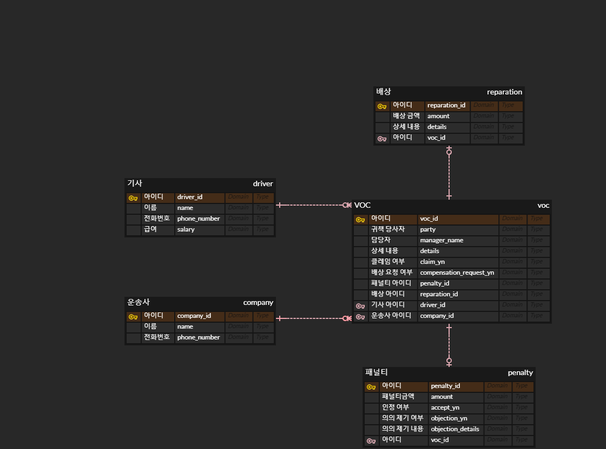
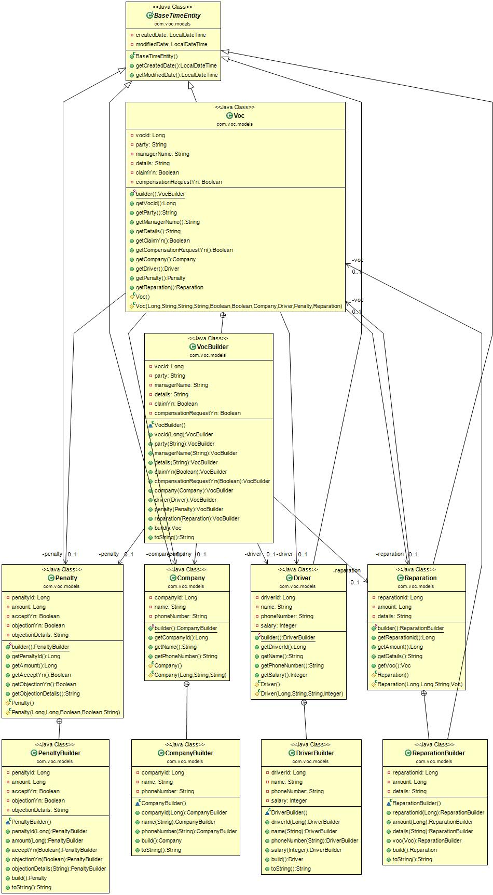

# Voice of Customer


## API

* VOC 목록 조회

  ```
  HTTP GET /api/v1/voc
  ```

* 배상 목록 조회

  ````
  HTTP GET /api/v1/reparations
  ````

* VOC 등록

  ```
  HTTP POST /api/v1/voc
  ```

* 패널티 등록

  ```
  HTTP POST /api/v1/voc/{id}/penalties
  ```

* 배송기사의 패널티 확인 여부 등록

  ```
  HTTP PUT /api/v1/voc/{id}/penalties
  ```
  
* 배상 등록

  ```
  HTTP POST /api/v1/voc/{id}/reparations
  ```

  

## 환경

* Open JDK 11
* SpringBoot 2.4.5
* H2
* JPA
* Gradle


## 테이블 스키마




## 클래스 다이어그램(Entity)

